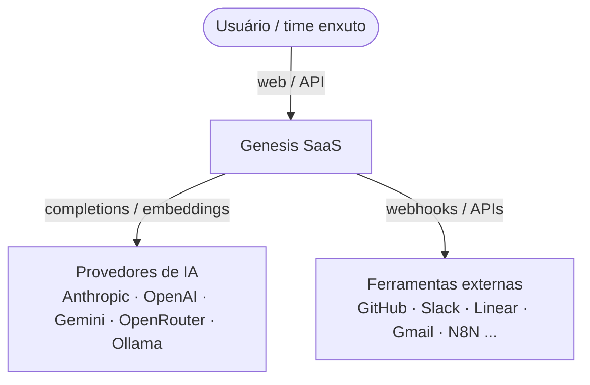

# 01 — Visão de Arquitetura

Genesis é uma plataforma SaaS **multi-tenant** que transforma ideias em produtos via agentes de IA, automação e workflows. Arquitetura **modular, API-first**, preparada para plugins e marketplace.

## Princípios

- **Modularidade por bounded context** (cada módulo é isolável).
- **Multi-tenancy shared-schema**: `organizationId` em toda entidade; isolamento garantido na camada de aplicação (guard + repositório), com RLS do Postgres planejado para reforço.
- **API-first**: tudo via REST `/api/v1` documentado em OpenAPI; UI é só mais um cliente.
- **IA agnóstica de provedor** com fallback (Anthropic primário).
- **Lean primeiro**: Postgres + Redis + Qdrant + S3. Filas via BullMQ (Redis); RabbitMQ/OpenSearch/observability entram por evolução.

## C4 — Contexto



## C4 — Containers

```mermaid
graph TD
  subgraph Client
    Web[apps/web<br/>Next.js + shadcn]
  end
  subgraph Backend
    API[apps/api<br/>NestJS REST /api/v1]
    Worker[BullMQ workers<br/>in-process no MVP]
  end
  subgraph Data
    PG[(PostgreSQL<br/>Prisma)]
    Redis[(Redis<br/>cache + filas)]
    Qdrant[(Qdrant<br/>vetores / RAG)]
    S3[(S3 / MinIO<br/>arquivos)]
  end
  subgraph Packages
    Shared[@genesis/shared]
    AI[@genesis/ai]
    DB[@genesis/db]
  end

  Web -->|HTTPS JSON| API
  API --> PG
  API --> Redis
  API --> Qdrant
  API --> S3
  API --> Worker
  API --- DB
  API --- AI
  Web --- Shared
  API --- Shared
```

## Camadas do backend (por módulo)

```
Controller (HTTP, validação Zod)  →  Service (regra de negócio, escopo de tenant)
        →  Prisma (persistência)   /  AiService (IA)  /  Qdrant (RAG)  /  BullMQ (jobs)
Cross-cutting: JwtAuthGuard · RolesGuard (RBAC) · AuditInterceptor
```

Ver também: [03-data-model.md](03-data-model.md), [04-api-structure.md](04-api-structure.md), [09-agent-structure.md](09-agent-structure.md).
