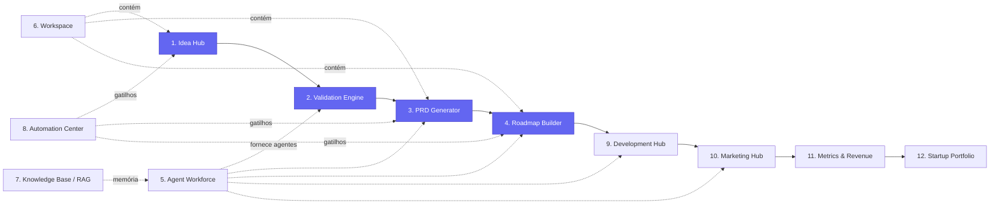

# 02 — Diagrama de Módulos

Os 12 módulos e suas dependências. O fluxo central (azul) é o caminho crítico ideia→produto; os demais são serviços de suporte.

## Mapa módulo → código

| # | Módulo | Entidades principais | Pacote/app |
|---|---|---|---|
| 1 | Idea Hub | `Idea` | `apps/api/src/ideas`, `apps/web/.../workspace` |
| 2 | Validation Engine | `Validation` | (fase 2) |
| 3 | PRD Generator | `Prd`, `PrdVersion` | (fase 1) |
| 4 | Roadmap Builder | `Roadmap`, `WorkItem` | (fase 1) |
| 5 | Agent Workforce | `Agent`, `AgentRun`, `Conversation`, `Message` | `@genesis/ai` |
| 6 | Workspace | `Workspace` | transversal |
| 7 | Knowledge Base | `KnowledgeDocument`, `KnowledgeChunk` + Qdrant | (fase 2) |
| 8 | Automation Center | `Automation` + BullMQ | (fase 3) |
| 9 | Development Hub | `Integration` | (fase 3) |
| 10 | Marketing Hub | `Agent` (marketing) | (fase 4) |
| 11 | Metrics & Revenue | `Metric` | (fase 4) |
| 12 | Startup Portfolio | agregação de `Workspace`/`Metric` | (fase 4) |
