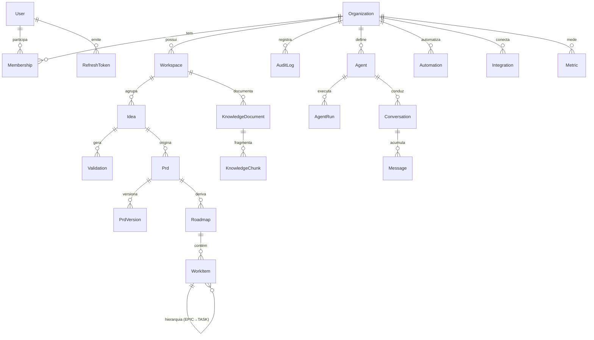

# 03 — Modelo de Dados

Schema canônico em [`packages/db/prisma/schema.prisma`](../../packages/db/prisma/schema.prisma). Multi-tenant shared-schema: toda entidade de negócio referencia `Organization` via `organizationId`.

## ERD (núcleo)

## Convenções

- **PK**: `cuid()`. **Timestamps**: `createdAt`/`updatedAt`.
- **Tenant**: `organizationId` indexado em toda tabela de negócio; queries sempre filtram por ele (ver `IdeasService`).
- **JSONB** para conteúdo flexível: `Idea.aiInsights`, `PrdVersion.content`, `Validation.*`, `Automation.trigger/actions`, `Integration.config/credentials`.
- **Vetores** ficam no Qdrant; `KnowledgeChunk.vectorId` referencia o ponto.
- **Soft-delete** não usado no MVP; cascatas via `onDelete`.

## Dicionário (entidades-chave)

| Entidade | Campos notáveis | Observação |
|---|---|---|
| `Idea` | `revenuePotential`, `complexity`, `ecosystemSynergy`, `estimatedMvpDays`, `status`, `aiInsights` | status: CAPTURED→…→APPROVED |
| `Validation` | `viabilityScore`, `swot`, `tamSamSom` | 1 ideia → N validações (histórico) |
| `PrdVersion` | `version`, `content`, `changeLog` | versionamento obrigatório (`@@unique([prdId, version])`) |
| `WorkItem` | `type` (EPIC/FEATURE/STORY/TASK), `status`, `parentId` | auto-relação hierárquica; assignee USER ou AGENT |
| `Agent` | `provider`, `model`, `tools[]`, `memoryConfig` | base do Agent Workforce |
