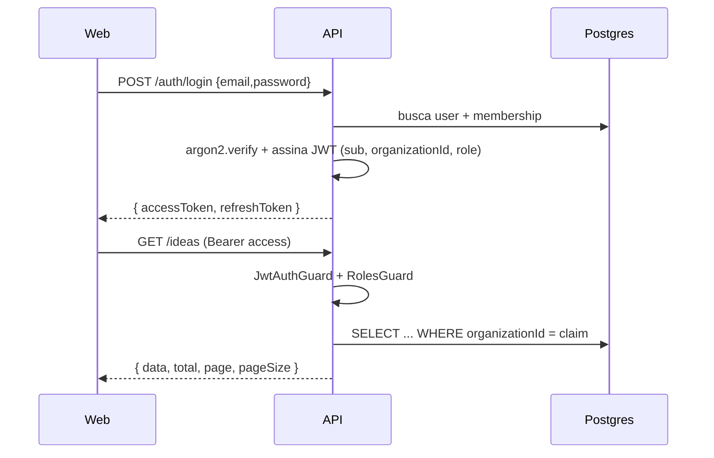

# 04 — Estrutura de APIs

REST versionada sob `/api/v1`. OpenAPI/Swagger em `/api/docs`. Auth via Bearer JWT (exceto rotas `@Public()`).

## Convenções

- **Auth**: `Authorization: Bearer <accessToken>`. Tenant ativo vem do claim `organizationId` do JWT — o cliente nunca envia o tenant.
- **RBAC**: papéis `OWNER > ADMIN > MEMBER > VIEWER` (ver [`roles.guard.ts`](../../apps/api/src/common/roles.guard.ts)).
- **Validação**: Zod (`@genesis/shared`) via `ZodValidationPipe`.
- **Paginação**: `?page=1&pageSize=20` → `{ data, total, page, pageSize }`.
- **Erros**: `{ statusCode, error, message }` (message pode ser array).
- **Auditoria**: toda mutação gera `AuditLog`.

## Endpoints (implementados na fundação)

| Método | Rota | Auth | Papel | Descrição |
|---|---|---|---|---|
| GET | `/health` | público | — | status + ping no banco |
| POST | `/auth/register` | público | — | cria org + usuário OWNER |
| POST | `/auth/login` | público | — | retorna access/refresh token |
| GET | `/auth/me` | bearer | qualquer | usuário + tenant atual |
| GET | `/ideas` | bearer | VIEWER+ | lista paginada (escopo do tenant) |
| GET | `/ideas/:id` | bearer | VIEWER+ | detalhe |
| POST | `/ideas` | bearer | MEMBER+ | cria ideia |
| PATCH | `/ideas/:id` | bearer | MEMBER+ | atualiza |
| DELETE | `/ideas/:id` | bearer | ADMIN+ | remove |

## Endpoints planejados (fases)

```
/workspaces            CRUD de workspaces
/prds  /prds/:id/versions   PRD + versionamento
/roadmaps  /work-items       roadmap → épicos/features/stories/tasks (Kanban)
/agents  /agents/:id/runs    Agent Workforce
/knowledge  /knowledge/search  Knowledge Base + busca semântica (RAG)
/automations  /integrations    Automation Center + conectores
/metrics  /portfolio           Metrics & Revenue, Startup Portfolio
```

## Fluxo de autenticação


