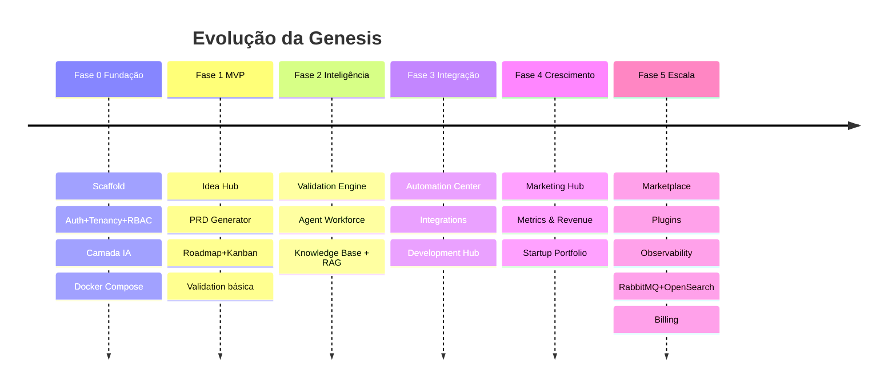

# 05 — Roadmap de Desenvolvimento

## Fase 0 — Fundação ✅ (esta entrega)

Scaffold do monorepo · Docker Compose (Postgres/Redis/Qdrant/MinIO/Mailhog) · Prisma + migration + seed · Auth JWT (register/login/me) · Multi-tenancy + RBAC + AuditLog · Camada de IA com fallback (Anthropic) · Swagger · Web shell (login + workspace). Módulo `ideas` como referência de padrão.

## Fase 1 — MVP

- **Idea Hub**: brain dump, upload de notas, insights de IA, histórico.
- **PRD Generator**: geração via agente a partir da ideia; edição humana; versionamento.
- **Roadmap Builder**: PRD → épicos/features/stories/tasks; Kanban + timeline.
- **Validation**: score básico de viabilidade.

## Fase 2 — Inteligência

Validation Engine completo (mercado, SWOT, TAM/SAM/SOM) · Agent Workforce (agentes especializados + colaboração) · Knowledge Base + RAG (ingestão, embeddings, Qdrant, busca semântica).

## Fase 3 — Integração

Automation Center (gatilhos via BullMQ) · Integrations (GitHub, Slack, Linear, Gmail, N8N…) · Development Hub (Claude Code, OpenAI, Codex, Cursor).

## Fase 4 — Crescimento

Marketing Hub (SEO/blog/social, calendário editorial) · Metrics & Revenue (MRR, churn, CAC, LTV) · Startup Portfolio (visão consolidada, ROI).

## Fase 5 — Escala / Comercial

Marketplace de agentes · plugins · observability (Grafana/Prometheus/Loki) · RabbitMQ + OpenSearch para escala · billing/cobrança.
