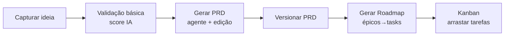

# 06 — Escopo do MVP

Fatia fina ponta-a-ponta: **Idea → PRD → Roadmap → Tarefas**. Objetivo: provar o loop "ideia vira backlog executável" com assistência de IA, multi-tenant desde o dia 1.

## Dentro do escopo

- Auth + organização + workspace (fundação já entregue).
- **Idea Hub**: CRUD, brain dump, tags, insights de IA (riscos/oportunidades/concorrentes).
- **PRD**: geração assistida (1 agente "Product Manager"), edição, versionamento.
- **Roadmap**: PRD → `WorkItem` hierárquico; board Kanban com status e prioridade.
- 1 provedor de IA real (Anthropic) com fallback configurável.

## Fora do escopo (fases seguintes)

Multi-agente colaborativo · RAG/Knowledge Base · automações/integrações externas · marketing · métricas de receita · marketplace · observability completa.

## Critério de pronto

Usuário loga, cria uma ideia, gera um PRD por IA, deriva um roadmap e move tarefas no Kanban — tudo isolado por tenant e auditado.
