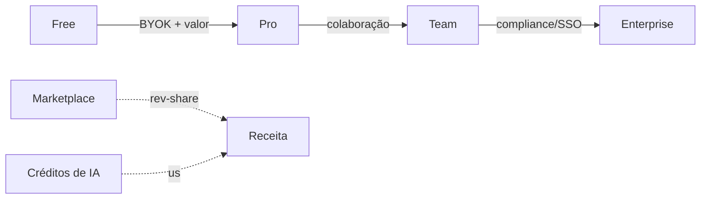

# 08 — Estratégia de Monetização

Modelo híbrido: **assinatura por tier + consumo de IA**, com upside via marketplace.

## Tiers

| Tier | Preço (ref.) | Limites | Público |
|---|---|---|---|
| **Free** | $0 | 1 workspace, BYOK obrigatório, 1 usuário | Validação / solo |
| **Pro** | $29/mês | 5 workspaces, créditos de IA inclusos, 3 seats | Indie / freelancer |
| **Team** | $99/mês | Workspaces ilimitados, RBAC, automações, 10 seats | Times enxutos |
| **Enterprise** | sob consulta | SSO, audit avançado, on-prem, SLA | Empresas |

## Vetores de receita

1. **Assinatura recorrente** (MRR) por tier.
2. **Créditos de IA por uso** — markup sobre tokens dos provedores; ou **BYOK** (traga sua própria chave) sem markup.
3. **Marketplace de agentes** — criadores publicam agentes/templates; Genesis fica com rev-share (ex.: 20%).
4. **Add-ons** — seats extras, integrações premium, capacidade de RAG/storage.

## Alavancas de unit economics

- BYOK reduz COGS de IA no Free e dá margem no Pro/Team.
- Multi-tenant shared-schema mantém custo de infra por tenant baixo (essencial para Free→Pro).
- Automação e agentes aumentam stickiness → reduz churn → eleva LTV.

