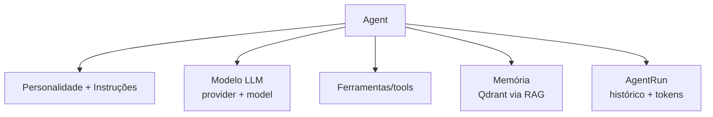
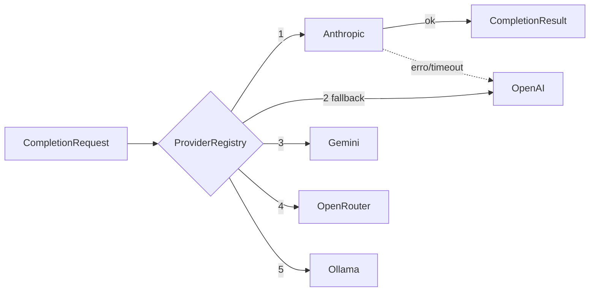
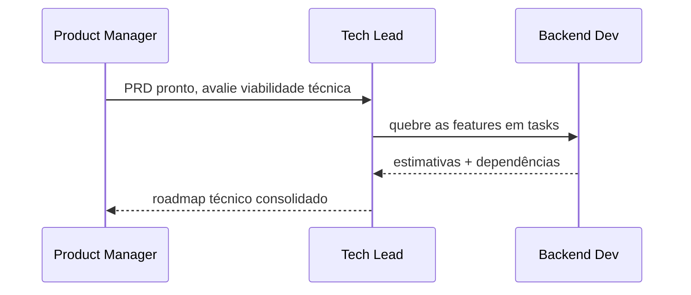

# 09 — Estrutura de Agentes

Base de código: [`packages/ai`](../../packages/ai). Entidades: `Agent`, `AgentRun`, `Conversation`, `Message` (ver [03-data-model.md](03-data-model.md)).

## Anatomia de um agente

Cada `Agent` carrega: `name`, `role`, `personality`, `instructions`, `provider` (default ANTHROPIC), `model` (default `claude-opus-4-8`), `tools[]`, `memoryConfig`.

## Camada de provedores (fallback)

`ProviderRegistry` (ver [`registry.ts`](../../packages/ai/src/registry.ts)) tenta cada provedor **configurado** na ordem (`AI_FALLBACK_ORDER`), passando ao próximo em falha. Anthropic já implementado com **prompt caching**; demais são stubs com a interface pronta.

## Catálogo de papéis (Agent Workforce)

Product Manager · Tech Lead · Backend Dev · Frontend Dev · QA Engineer · DevOps · Marketing Manager · SEO Specialist · Sales Assistant · Customer Success.

## Colaboração entre agentes (Fase 2)

Orquestrador roteia mensagens (`Conversation`/`Message`), injeta contexto via RAG e registra cada execução em `AgentRun` (tokens, provedor usado, status).
