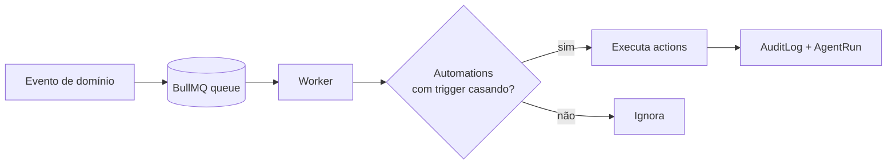
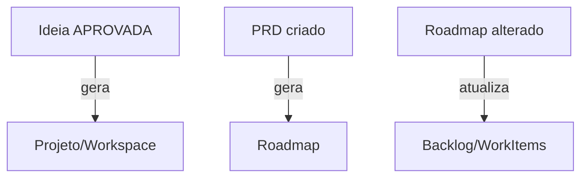

# 10 — Fluxos de Automação

Automation Center (Fase 3) é **event-driven** sobre BullMQ (Redis). Cada `Automation` tem `trigger` (evento + condições) e `actions` (lista de ações), persistidos em JSONB.

## Modelo gatilho → ação

## Gatilhos nativos (do brief)

| Evento | Condição | Ação |
|---|---|---|
| `idea.status_changed` | status = APPROVED | criar `Workspace` + `Prd` rascunho |
| `prd.created` | — | gerar `Roadmap` via agente |
| `roadmap.updated` | itens add/removidos | reconciliar `WorkItem` do backlog |
| `workitem.done` | type = TASK | notificar Slack / atualizar métricas |

## Eventos de domínio (catálogo inicial)

`idea.created` · `idea.status_changed` · `validation.completed` · `prd.created` · `prd.version_added` · `roadmap.updated` · `workitem.status_changed` · `agentrun.finished`.

## Integrações externas (Fase 3)

Saída para N8N, GitHub, GitLab, Jira, Linear, Slack, Discord, Telegram, Gmail, Google Calendar — via `Integration` (credenciais cifradas). Webhooks de entrada disparam os mesmos eventos de domínio, fechando o loop bidirecional.
